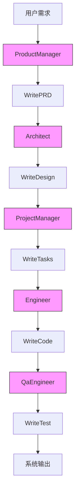
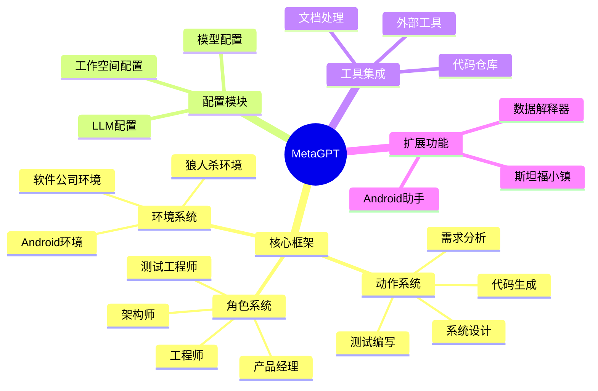

# MetaGPT仓库分析报告

## 基础信息
- **项目名称**: MetaGPT
- **项目描述**: 多智能体框架，通过分配不同角色给GPT模型形成协作实体以处理复杂任务
- **主要语言**: Python
- **最新提交**: 11cdf466 (Merge pull request #1897 from Ruyuan37/windows_terminal_adaptation)
- **许可证**: MIT

## 功能概述
MetaGPT是一个基于LLM的多智能体协作框架，模拟软件公司的工作流程，通过产品经理、架构师、项目经理、工程师等角色协作，将自然语言需求转化为完整的软件项目。核心能力包括：
- 需求分析与PRD生成
- 系统设计与API设计
- 代码生成与测试
- 项目管理与任务分配
- 支持多种LLM后端(OpenAI/Azure/Ollama等)
- 提供数据解释器、研究者等专用智能体

## 架构图


## 功能模块
### 1. 核心框架模块
- **角色系统** (metagpt/roles/)
  - `Role`: 所有角色基类，定义思考/行动/观察接口
  - `RoleZero`: 增强型角色基类，支持工具调用
  - 具体角色: ProductManager, Architect, Engineer, QaEngineer等

- **动作系统** (metagpt/actions/)
  - `Action`: 所有动作基类
  - 核心动作: WritePRD, WriteDesign, WriteCode, WriteTest等
  - 动作类型枚举: ActionType

- **环境系统** (metagpt/environment/)
  - `Environment`: 智能体交互环境基类
  - `SoftwareEnv`: 软件公司模拟环境
  - 其他环境: AndroidEnv, WerewolfEnv等

### 2. 配置模块
- `config2.py`: 核心配置类
- `llm_config.py`: LLM模型配置
- `workspace_config.py`: 工作空间配置
- 支持多LLM提供商配置(OpenAI/Anthropic/Azure等)

### 3. 工具模块
- 文档处理: Document, Documents
- 代码仓库管理: GitRepository, ProjectRepo
- 内存管理: Memory, LongTermMemory
- 外部工具集成: Browser, Editor, Terminal

### 4. 扩展模块
- 数据解释器: metagpt/roles/di/
- 狼人杀游戏环境: metagpt/environment/werewolf/
- 斯坦福小镇模拟: metagpt/ext/stanford_town/
- Android助手: metagpt/ext/android_assistant/

## 潜在风险
1. **配置安全风险**
   - `llm_config.py`中API密钥以明文形式存储
   - 建议: 使用环境变量或加密配置管理

2. **代码质量风险**
   - 存在大量TODO/FIXME标记(超过50处)
   - 部分模块间耦合度高(如Engineer与ProjectManager)

3. **依赖管理风险**
   - `setup.py`中部分依赖版本锁定过严(如gradio==3.0.0)
   - 可选依赖管理复杂，可能导致环境冲突

4. **可维护性风险**
   - 部分类职责不单一(如Engineer同时处理编码和代码审查)
   - 缺少完整的单元测试覆盖

## 非规范代码及建议
### 1. 硬编码问题
**文件**: metagpt/roles/engineer.py:480
```python
prd_filename=str(self.repo.docs.prd.workdir / self.repo.docs.prd.all_files[0])
```
**问题**: 直接使用索引0访问列表，可能导致IndexError
**建议**: 添加空值检查和异常处理
```python
if self.repo.docs.prd.all_files:
    prd_filename = str(self.repo.docs.prd.workdir / self.repo.docs.prd.all_files[0])
else:
    raise ValueError("No PRD files found")
```

### 2. 魔法字符串
**文件**: metagpt/const.py:58
```python
SERDESER_PATH = DEFAULT_WORKSPACE_ROOT / "storage"  # TODO to store `storage` under the individual generated project
```
**问题**: 硬编码目录名"storage"
**建议**: 定义为常量便于维护
```python
STORAGE_DIR = "storage"
SERDESER_PATH = DEFAULT_WORKSPACE_ROOT / STORAGE_DIR
```

### 3. 未处理的异常
**文件**: metagpt/actions/debug_error.py
**问题**: 未实现错误处理逻辑
**建议**: 添加try-except块捕获并处理异常

### 4. 代码重复
**文件**: metagpt/roles/di/data_analyst.py:146
```python
# TODO: duplicate with Engineer2._run_special_command, consider dedup
```
**建议**: 提取公共方法到工具类或基类

### 5. 注释不规范
**文件**: metagpt/ext/werewolf/roles/base_player.py:72
```python
# TODO to delete
```
**问题**: 注释模糊，未说明删除原因和时间
**建议**: 提供具体上下文
```python
# TODO: Remove this debug code after werewolf game logic is stabilized (2024-06-30)
```

## 业务逻辑思维导图


## 总结
MetaGPT通过模拟软件公司协作流程，成功将复杂需求分解为多智能体协作任务。项目架构清晰，但存在代码质量和可维护性问题。建议优先解决TODO/FIXME问题，优化依赖管理，并加强单元测试覆盖。未来可考虑引入依赖注入和解耦设计，提高系统灵活性和可扩展性。